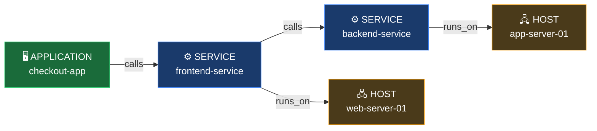
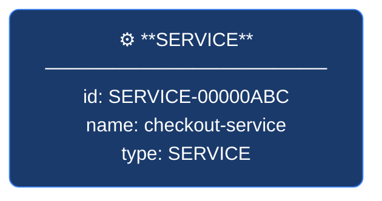
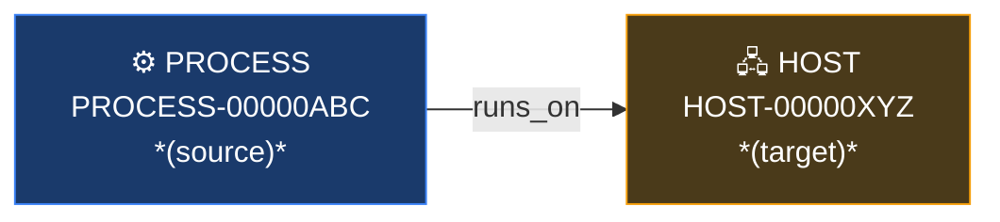

# SmartScape on Grail — Developer Guide

A practical, easy-to-digest guide for querying topology data using Dynatrace's SmartScape DQL commands.

---

## Table of Contents

1. [What is SmartScape on Grail?](#what-is-smartscape-on-grail)
2. [Core Concepts](#core-concepts)
3. [Nodes vs Edges](#nodes-vs-edges)
4. [The Three Commands](#the-three-commands)
   - [smartscapeNodes](#smartscapenodes)
   - [smartscapeEdges](#smartscapeedges)
   - [traverse](#traverse)
5. [Helper Functions](#helper-functions)
6. [Entity Views (`dt.entity.*`)](#entity-views-dtentity)
7. [Node & Edge Types Reference](#node--edge-types-reference)
8. [Common Patterns & Recipes](#common-patterns--recipes)

---

## What is SmartScape on Grail?

SmartScape on Grail is Dynatrace's topology engine, accessible via DQL. It models your environment as a **graph** — nodes are entities, edges are the relationships between them.



Each box is a **node** (entity). Each arrow is an **edge** (relationship).

You query nodes and edges directly in DQL using three commands:
- `smartscapeNodes` — fetch entities
- `smartscapeEdges` — fetch relationships between entities
- `traverse` — walk the graph from a starting set of nodes

---

## Core Concepts

| Term | Meaning |
|------|---------|
| **Node** | An entity (host, service, process, etc.) |
| **Edge** | A directed relationship between two entities (e.g. `calls`, `runs_on`) |
| **Node type** | Short uppercase name for the entity type: `HOST`, `SERVICE`, `PROCESS`, etc. |
| **Edge type** | Lowercase relationship name: `calls`, `runs_on`, `belongs_to`, etc. |
| **SmartScape ID** | The internal graph ID for an entity (e.g. `HOST-07A2F9F20F9F2D68`) |

> **Note:** SmartScape node types (`HOST`, `SERVICE`) are different from the `dt.entity.*` names used with `fetch`. See the [reference table](#node--edge-types-reference) for the mapping.

---

## Nodes vs Edges

Understanding the distinction between nodes and edges is key to working with SmartScape effectively.

### Nodes — What exists

A **node** represents a monitored entity: a host, service, process, Kubernetes pod, etc. Each node has:

- A **type** — short uppercase name for the entity kind (e.g. `HOST`, `SERVICE`)
- An **ID** — a unique SmartScape identifier for that entity
- **Attributes** — properties like name, tags, management zones, etc.

Nodes are the "things" in your environment. When you query `smartscapeNodes`, you're asking: *"Give me all entities of this type."*



Nodes don't inherently tell you anything about how entities relate to each other — that's what edges are for.

---

### Edges — How things connect

An **edge** is a directed relationship between two nodes. It has:

- A **type** — what kind of relationship it is (e.g. `calls`, `runs_on`, `belongs_to`)
- A **source** — the entity the relationship originates from
- A **target** — the entity the relationship points to

Edges are directional. `calls` goes from the calling service → to the called service. If you want to find *callers* of a service, you traverse `backward` along that edge type.



When you query `smartscapeEdges`, you're asking: *"Give me all relationships of this type across the entire environment."* This returns a flat table of source/target pairs — useful for mapping dependencies or counting connections, but you need to join with node data to get entity names/attributes.

---

### When to use which

| Goal | Use |
|------|-----|
| List entities of a type with their attributes | `smartscapeNodes` |
| Find all relationships of a given type | `smartscapeEdges` |
| Start from specific nodes and walk to connected nodes | `smartscapeNodes` + `traverse` |
| Count how many services call each other | `smartscapeEdges` + `summarize` |
| Get process names + the hosts they run on | `smartscapeNodes` + `traverse` |

The most powerful pattern is combining all three: use `smartscapeNodes` to define your starting set, `traverse` to walk edges to related entities, and `smartscapeEdges` when you need raw relationship data without a fixed starting point.

---

## The Three Commands

---

### `smartscapeNodes`

Loads entity nodes into the DQL pipeline by type.

#### Syntax

```dql
smartscapeNodes <TYPE>
smartscapeNodes {<TYPE1>, <TYPE2>}   // multiple types
smartscapeNodes "<GLOB*>"            // pattern matching
```

The type is a **positional argument** passed directly after the command — no parameter name or colon needed.

#### Parameters

| Parameter | Required | Description |
|-----------|----------|-------------|
| type | Yes | Node type(s). Use `"*"` for all, or specific types like `HOST`, `SERVICE`. Glob patterns must be quoted: `"K8S_*"` |
| from / to | No | Time range override |

#### Fields returned

| Field | Type | Description |
|-------|------|-------------|
| `id` | string | SmartScape entity ID (e.g. `HOST-07A2F9F20F9F2D68`) |
| `type` | string | Entity type (e.g. `HOST`, `SERVICE`) |
| `name` | string | Display name |

#### Examples

**Load all hosts:**
```dql
smartscapeNodes HOST
| fields id, name, type
```

**Load all services and frontends:**
```dql
smartscapeNodes SERVICE, FRONTEND
| fields id, name, type
```

**Use a glob to match all Kubernetes types:**
```dql
smartscapeNodes "K8S_*"
| fields id, name, type
| dedup type
```

**Discover all node types in your environment:**
```dql
smartscapeNodes "*"
| fields type
| dedup type
```

---

### `smartscapeEdges`

Loads topology edges — the relationships between entities. Each row is a directed source → target pair.

#### Syntax

```dql
smartscapeEdges <edge_type>
smartscapeEdges "<GLOB*>"    // pattern matching, must be quoted
```

#### Parameters

| Parameter | Required | Description |
|-----------|----------|-------------|
| type | Yes | Edge type(s). Lowercase names like `runs_on`, `calls`. Use `"*"` for all. Glob patterns must be quoted. |
| from / to | No | Time range override |

#### Fields returned

| Field | Type | Description |
|-------|------|-------------|
| `type` | string | The relationship type (e.g. `runs_on`, `calls`) |
| `source_id` | string | SmartScape ID of the source entity |
| `source_type` | string | Node type of the source (e.g. `PROCESS`) |
| `target_id` | string | SmartScape ID of the target entity |
| `target_type` | string | Node type of the target (e.g. `HOST`) |

> **Note:** The field is named `type`, not `edge_type`.

#### Examples

**All edges of any type:**
```dql
smartscapeEdges "*"
| fields type, source_id, target_id
```

**Only "runs on" relationships:**
```dql
smartscapeEdges runs_on
| fields type, source_id, source_type, target_id, target_type
```

**Service-to-service call relationships:**
```dql
smartscapeEdges calls
| filter source_type == "SERVICE"
| fields source_id, target_id
```

**Count all relationship types:**
```dql
smartscapeEdges "*"
| summarize count(), by: {type}
| sort count desc
```

**All edges from Kubernetes Pods:**
```dql
smartscapeEdges "*"
| filter source_type == "K8S_POD"
| summarize by: {type, target_type}, edges = count()
```

---

### `traverse`

Starts from a set of source nodes and follows edges to reach connected target nodes. Piped after `smartscapeNodes`.

#### Syntax

```dql
smartscapeNodes <SOURCE_TYPE>
| traverse {<edge_type>}, {<TARGET_TYPE>} [, direction: forward|backward] [, fieldsKeep: {field, ...}] [, nodeId: field]
```

Both the edge type and target type are **positional arguments** passed as `{}` groups.

#### Parameters

| Parameter | Required | Default | Description |
|-----------|----------|---------|-------------|
| edgeType | Yes | — | Edge type(s) to follow. Glob supported. Use `{runs_on}` or `{"*"}` |
| targetType | Yes | — | Target node type(s) to reach. Use `{HOST}` or `{"*"}` |
| `direction` | No | `forward` | `forward` follows edges source→target; `backward` follows target→source |
| `fieldsKeep` | No | — | Fields from the source node to include in `dt.traverse.history` entries |
| `nodeId` | No | `id` | Field containing the source node ID to traverse from |

> **Note:** There is no `maxDepth` parameter. To do multi-hop traversal, chain multiple `traverse` commands.

#### Special field: `dt.traverse.history`

Every result from `traverse` includes `dt.traverse.history` — an array of objects showing the path taken to reach that node. Each entry contains:

```json
{
  "id": "HOST-07A2F9F20F9F2D68",
  "edge_type": "runs_on",
  "direction": "BACKWARD",
  "name": "web-server-01"   // only if fieldsKeep: {name} was set
}
```

The length of the array tells you how many hops away the result is.

#### Examples

**From hosts, find all processes running on them:**
```dql
smartscapeNodes HOST
| traverse {runs_on}, {PROCESS}, direction: backward
| fields id, name, type, dt.traverse.history
```

**From a service, find what it calls:**
```dql
smartscapeNodes SERVICE
| filter name == "BrokerService"
| traverse {calls}, {SERVICE}, direction: forward
| fields id, name, dt.traverse.history
```

**Keep source node name in history for traceability:**
```dql
smartscapeNodes SERVICE
| filter name == "BrokerService"
| traverse {calls}, {SERVICE}, direction: forward, fieldsKeep: {name}
| fields id, name, dt.traverse.history
```

**Multi-hop: processes → hosts, then hosts → containers (chained):**
```dql
smartscapeNodes PROCESS
| traverse {runs_on}, {HOST}, direction: forward
| traverse {runs_on}, {CONTAINER}, direction: forward
| fields id, name, type, dt.traverse.history
```

**Find all services that call a specific service (reverse lookup):**
```dql
smartscapeNodes SERVICE
| filter name == "BrokerService"
| traverse {calls}, {SERVICE}, direction: backward
| fields id, name, dt.traverse.history
```

**Traverse all edge types to any target:**
```dql
smartscapeNodes HOST
| traverse {"*"}, {"*"}, direction: forward
| fields id, name, type, dt.traverse.history
```

---

## Helper Functions

These DQL functions convert between classic Dynatrace entity IDs and SmartScape IDs.

---

### `toSmartscapeId()`

Converts a classic entity ID string to a SmartScape-compatible ID for use in filters.

```dql
| fieldsAdd ss_id = toSmartscapeId("HOST-07A2F9F20F9F2D68")
```

**Example — start traverse from a known host ID:**
```dql
smartscapeNodes HOST
| filter id == toSmartscapeId("HOST-07A2F9F20F9F2D68")
| traverse {runs_on}, {PROCESS}, direction: backward
| fields id, name
```

---

### `classicEntitySelector()`

Converts a classic entity selector string into a list of entity IDs. This function works with `fetch dt.entity.*` queries, not with `smartscapeNodes`.

```dql
fetch dt.entity.host
| filter id in classicEntitySelector("type(HOST),tag(production)")
| fields entity.name, id
```

**Selector examples:**
| Selector | Meaning |
|----------|---------|
| `type(HOST),tag(production)` | All production hosts |
| `type(SERVICE),mzName(my-zone)` | Services in management zone |
| `type(APPLICATION),entityName(checkout*)` | Apps matching name glob |

> **Note:** `classicEntitySelector()` is **not supported** inside `smartscapeNodes` filters. Use it with `fetch dt.entity.*` to get IDs, then use `toSmartscapeId()` if you need to bridge into SmartScape queries.

---

## Entity Views (`dt.entity.*`)

For attribute lookups and filtering without topology traversal, query entity tables directly using `fetch`. These use a different naming convention (`dt.entity.host`) than SmartScape (`HOST`).

```dql
fetch dt.entity.host
| fields entity.name, entity.detected_name, tags, managementZones
| limit 50
```

These views are fast for filtering and counting but don't include topology edges.

**Common entity views:**

| `fetch` view | SmartScape type | Description |
|-------------|-----------------|-------------|
| `dt.entity.host` | `HOST` | Physical or virtual hosts |
| `dt.entity.service` | `SERVICE` | Services |
| `dt.entity.process_group_instance` | `PROCESS` | Individual processes |
| `dt.entity.application` | `FRONTEND` | Web applications |
| `dt.entity.kubernetes_cluster` | `K8S_CLUSTER` | Kubernetes clusters |
| `dt.entity.kubernetes_node` | `K8S_NODE` | Kubernetes nodes |
| `dt.entity.kubernetes_pod` | `K8S_POD` | Kubernetes pods |
| `dt.entity.cloud_application` | `K8S_DEPLOYMENT` | K8s workloads/deployments |
| `dt.entity.cloud_application_namespace` | `K8S_NAMESPACE` | K8s namespaces |

**Example — count hosts per management zone:**
```dql
fetch dt.entity.host
| fieldsAdd mz = managementZones[0]
| summarize hosts = count(), by: {mz}
| sort hosts desc
```

---

## Node & Edge Types Reference

### Node Types (confirmed on this tenant)

| SmartScape Type | Description |
|----------------|-------------|
| `HOST` | Physical or virtual hosts |
| `SERVICE` | Services |
| `PROCESS` | Individual process group instances |
| `CONTAINER` | Containers |
| `FRONTEND` | Web / RUM applications |
| `NETWORK_INTERFACE` | Network interfaces |
| `DISK` | Disk devices |
| `ONEAGENT` | OneAgent instances |
| `K8S_CLUSTER` | Kubernetes clusters |
| `K8S_NODE` | Kubernetes nodes |
| `K8S_POD` | Kubernetes pods |
| `K8S_NAMESPACE` | Kubernetes namespaces |
| `K8S_DEPLOYMENT` | Kubernetes deployments |
| `K8S_DAEMONSET` | Kubernetes daemon sets |
| `K8S_STATEFULSET` | Kubernetes stateful sets |
| `K8S_REPLICASET` | Kubernetes replica sets |
| `K8S_SERVICE` | Kubernetes services |
| `K8S_CRONJOB` | Kubernetes cron jobs |
| `K8S_DYNAKUBE` | Dynatrace Kubernetes operator |
| `K8S_NETWORKPOLICY` | Kubernetes network policies |

### Edge Types (confirmed on this tenant)

| Edge Type | Direction | Meaning |
|-----------|-----------|---------|
| `runs_on` | PROCESS → HOST / CONTAINER | Process runs on a host or container |
| `calls` | SERVICE → SERVICE | Service calls another service |
| `belongs_to` | Many → parent | Entity belongs to a group/cluster |
| `is_part_of` | Component → whole | Component is part of a larger entity |
| `monitors` | ONEAGENT → HOST | OneAgent monitors a host |
| `uses` | Entity → dependency | Entity uses another entity |

---

## Common Patterns & Recipes

---

### Discover all node and edge types in your environment

```dql
smartscapeNodes "*"
| fields type
| dedup type
```

```dql
smartscapeEdges "*"
| fields type
| dedup type
```

---

### Map all processes on a host

```dql
smartscapeNodes HOST
| filter name == "ip-192-168-34-67.ec2.internal"
| traverse {runs_on}, {PROCESS}, direction: backward
| fields name, id
```

---

### Find all services a process group calls

```dql
smartscapeNodes PROCESS
| filter name == "flagd-build flagd-*"
| traverse {calls}, {SERVICE}, direction: forward, fieldsKeep: {name}
| fields id, name, dt.traverse.history
```

---

### Topology map: count what each service calls

```dql
smartscapeEdges calls
| filter source_type == "SERVICE"
| summarize outbound_calls = count(), by: {source_id}
| sort outbound_calls desc
```

---

### Count relationship types in your environment

```dql
smartscapeEdges "*"
| summarize edges = count(), by: {type}
| sort edges desc
```

---

### Filter by management zone then traverse

```dql
// First get IDs from the classic entity selector via fetch
fetch dt.entity.host
| filter id in classicEntitySelector("type(HOST),mzName(Production)")
| fields id, entity.name
```

---

### Trace a service call chain

```dql
smartscapeNodes SERVICE
| filter name == "BrokerService"
| traverse {calls}, {SERVICE}, direction: forward, fieldsKeep: {name}
| fields name, dt.traverse.history
| sort arraySize(dt.traverse.history) asc
```

The `dt.traverse.history` array length tells you how many hops away each service is.

---

### Find all Kubernetes pods in a cluster

```dql
smartscapeNodes K8S_CLUSTER
| filter name == "gabrielgke"
| traverse {belongs_to}, {K8S_POD}, direction: backward
| fields name, id, dt.traverse.history
```

---

## Quick Reference Card

```
┌─────────────────────────────────────────────────────────────────────┐
│                     SmartScape DQL Cheatsheet                       │
├───────────────────────┬─────────────────────────────────────────────┤
│ Load nodes            │ smartscapeNodes HOST                        │
│                       │ smartscapeNodes {HOST, SERVICE}             │
│                       │ smartscapeNodes "K8S_*"                     │
├───────────────────────┼─────────────────────────────────────────────┤
│ Load edges            │ smartscapeEdges runs_on                     │
│                       │ smartscapeEdges "*"                         │
├───────────────────────┼─────────────────────────────────────────────┤
│ Walk graph            │ | traverse {calls}, {SERVICE}               │
│                       │     direction: forward / backward           │
│                       │     fieldsKeep: {name}                      │
├───────────────────────┼─────────────────────────────────────────────┤
│ Convert classic ID    │ toSmartscapeId("HOST-000...")               │
│ Filter by selector    │ classicEntitySelector("type(HOST),...")     │
├───────────────────────┼─────────────────────────────────────────────┤
│ Path history          │ dt.traverse.history → array of              │
│                       │   {id, edge_type, direction, ...keepFields} │
│ Simple entity fetch   │ fetch dt.entity.host                        │
└───────────────────────┴─────────────────────────────────────────────┘
```

---

## Further Reading

- [SmartScape on Grail — Dynatrace Docs](https://docs.dynatrace.com/docs/platform/grail/smartscape-on-grail)
- [SmartScape DQL Commands Reference](https://docs.dynatrace.com/docs/platform/grail/dynatrace-query-language/commands/smartscape-commands)
- [DQL Language Reference](https://docs.dynatrace.com/docs/platform/grail/dynatrace-query-language)
- [Entity Selector Reference](https://docs.dynatrace.com/docs/platform/grail/dynatrace-query-language/functions/classicEntitySelector)
