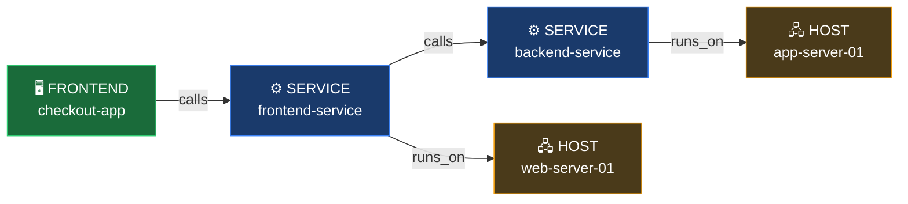
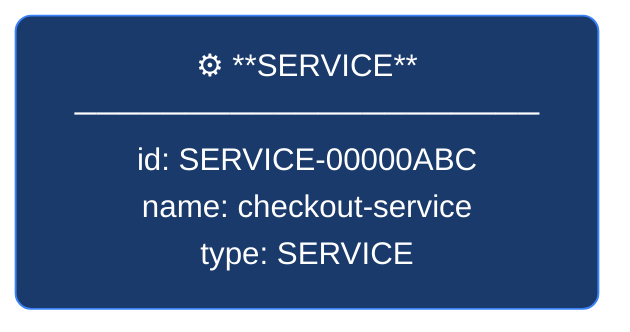
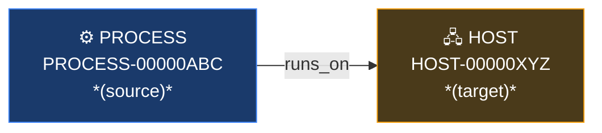

# SmartScape on Grail — Developer Guide

A practical, easy-to-digest guide for querying topology data using Dynatrace's SmartScape DQL commands.

---

## Table of Contents

1. [What is SmartScape on Grail?](#what-is-smartscape-on-grail)
2. [SmartScape vs. Classic SmartScape](#smartscape-vs-classic-smartscape)
3. [The SmartScape App](#the-smartscape-app)
4. [Core Concepts](#core-concepts)
5. [Segments (Replacing Management Zones)](#segments-replacing-management-zones)
6. [Nodes vs Edges](#nodes-vs-edges)
7. [The Three Commands](#the-three-commands)
   - [smartscapeNodes](#smartscapenodes)
   - [smartscapeEdges](#smartscapeedges)
   - [traverse](#traverse)
8. [Helper Functions](#helper-functions)
9. [Entity Views (`dt.entity.*`) — Legacy](#entity-views-dtentity--legacy)
10. [Node & Edge Types Reference](#node--edge-types-reference)
11. [Common Patterns & Recipes](#common-patterns--recipes)
12. [Tips](#tips)
13. [Quick Reference Card](#quick-reference-card)
14. [Further Reading](#further-reading)

---

## What is SmartScape on Grail?

SmartScape on Grail is Dynatrace's topology engine, accessible via DQL. It models your environment as a **graph** — nodes are entities, edges are the relationships between them. It is a complete rebuild of SmartScape Classic and is queryable, segment-aware, and integrated across all data sources (OneAgent, OpenTelemetry, cloud providers, Kubernetes, extensions, and more).



Each box is a **node** (entity). Each arrow is an **edge** (relationship).

You query nodes and edges directly in DQL using three commands:
- `smartscapeNodes` — fetch entities
- `smartscapeEdges` — fetch relationships between entities
- `traverse` — walk the graph from a starting set of nodes

---

## SmartScape vs. Classic SmartScape

| Capability | SmartScape Classic | SmartScape on Grail |
|---|---|---|
| **Entity types** | 5 (host, process, service, application, a few cloud) | 100+ (all cloud, Kubernetes, extensions, etc.) |
| **DQL query** | One entity type at a time, complex nested lookups | Single command queries multiple types |
| **Traversal** | Entity selectors (cumbersome) | `traverse` command with `direction` and `fieldsKeep` |
| **Filtering/scoping** | Management zones | Segments built on Grail fields |
| **Permissions** | Management zones | IAM policies + segments (decoupled) |
| **OpenTelemetry** | Limited, not always queryable | Full support — OTel traces draw the service dependency graph alongside OneAgent |
| **OpenPipeline** | Not integrated | Can extract topology nodes and edges from any pipeline data |
| **Custom topology** | Not supported | Supported via OpenPipeline node/edge extraction |

> **Note:** Not every entity type has migrated to SmartScape on Grail yet. Network devices and custom devices are not available in SmartScape on Grail at this time. They remain in the classic model and will move over as dedicated entity types (e.g., `NETWORK_DEVICE`, `NETWORK_INTERFACE`) are introduced.

---

## The SmartScape App

Dynatrace includes a new **SmartScape app** (search for "SmartScape" in Apps — use the pink new app, not SmartScape Classic).

The app ships with several pre-built views:

| View | Description |
|------|-------------|
| **Explore** | Full topology map across all entity types |
| **Infrastructure Overview** | Infrastructure-focused entity view for admins |
| **Problem Graph** | Shows entities related to active problems (causal AI) |
| **Service Dependency Graph** | Service-to-service call map; works with both OneAgent and OpenTelemetry |
| **Cloud provider views** | Pre-built views for AWS, Azure, and GCP (as integrations mature) |

**Service Dependency Graph** is a notable upgrade — it works with OneAgent, pure OTel, or a hybrid mix. Click any node to see response time, throughput, and failure rate. Click **View Topology** to see the full chain: service → process → pod → node → container → host → EC2 instance → availability zone.

**Segments** control what appears in the app. Switching segments refreshes all views automatically.

> **Note:** Custom SmartScape views (user-created documents) are not yet available but are planned. Dashboards will eventually include a node graph tile type.

---

## Core Concepts

| Term | Meaning |
|------|---------|
| **Node** | An entity (host, service, process, Kubernetes pod, etc.) |
| **Edge** | A directed relationship between two entities (e.g. `calls`, `runs_on`) |
| **Node type** | Short uppercase name for the entity type: `HOST`, `SERVICE`, `PROCESS`, etc. |
| **Edge type** | Lowercase relationship name: `calls`, `runs_on`, `belongs_to`, etc. |
| **SmartScape ID** | The internal graph ID for an entity (e.g. `HOST-0A1B2C3D4E5F6789`) |
| **Segment** | A scoped view of SmartScape built on Grail field filters — replaces management zones for filtering |
| **Primary Grail field** | A top-level field on a SmartScape node (e.g. `cloud.provider`, `k8s.namespace.name`) used to build segment filters |

> **Important:** SmartScape on Grail does **not** use management zones for filtering or scoping. Segments are the replacement. See [Segments](#segments-replacing-management-zones).

> **Note:** SmartScape node types (`HOST`, `SERVICE`) are different from the `dt.entity.*` names used with `fetch`. See the [reference table](#node--edge-types-reference) for the mapping. Classic entity IDs are preserved on SmartScape nodes for compatibility.

---

## Segments (Replacing Management Zones)

Management zones have been split into two separate concepts in Grail:

| Old (Management Zones) | New (Grail) |
|---|---|
| Filtering / scoping entities | **Segments** — filter on Grail fields |
| Access control / permissions | **IAM policies** — `storage.smartscape.read` with field-level conditions |

### What are Segments?

A segment is a simple field filter applied across all Grail data — metrics, logs, traces, spans, events, and SmartScape entities — using the same field names. Because the semantic dictionary ensures consistent field names across all data types, a segment built on `k8s.namespace.name` will filter entities, metrics, and logs all together.

**Example — segment filter for a cloud provider:**
```
filter cloud.provider == "$cloud_provider"
```

That single filter, applied as a segment, will correctly scope all SmartScape entities and associated telemetry to that cloud provider.

### Building Segments

1. Query SmartScape nodes to discover available field values:
```dql
smartscapeNodes "*"
| fields cloud.provider
| dedup cloud.provider
```

2. Use those field values to define the segment filter in the Segments UI.

### Segments and IAM

To restrict what a user can *see* (not just filter), combine IAM policy conditions with segments:

- Grant: `storage.smartscape.read` where `k8s.namespace.name == "team-a"`
- Grant: `storage.metrics.read` where `k8s.namespace.name == "team-a"`
- Grant: `storage.logs.read` where `k8s.namespace.name == "team-a"`

Because field names are shared across data types via the semantic dictionary, this consistently restricts entities, metrics, and logs all at once.

### Migrating from Management Zones

There is no automated migration path from management zones to segments. Simple management zones (e.g., "anything tagged X") are relatively straightforward to recreate. Complex ones with dependency trees or cloud-specific filtering are harder and may require a redesign rather than a direct port.

> **Tip:** The **Semantic Dictionary** (search for it in Dynatrace) lists all available Grail fields and their values — use it to discover what fields are available for building segment filters.

---

## Nodes vs Edges

Understanding the distinction between nodes and edges is key to working with SmartScape effectively.

### Nodes — What exists

A **node** represents a monitored entity: a host, service, process, Kubernetes pod, etc. Each node has:

- A **type** — short uppercase name for the entity kind (e.g. `HOST`, `SERVICE`)
- An **ID** — a unique SmartScape identifier for that entity
- **Attributes** — properties like name, tags, cloud metadata, Kubernetes labels, and configuration data

Nodes are the "things" in your environment. When you query `smartscapeNodes`, you're asking: *"Give me all entities of this type."*



Nodes don't inherently tell you anything about how entities relate to each other — that's what edges are for.

---

### Edges — How things connect

An **edge** is a directed relationship between two nodes. It has:

- A **type** — what kind of relationship it is (e.g. `calls`, `runs_on`, `belongs_to`)
- A **source** — the entity the relationship originates from
- A **target** — the entity the relationship points to

Edges are directional. `calls` goes from the calling service → to the called service. If you want to find *callers* of a service, you traverse `backward` along that edge type.



When you query `smartscapeEdges`, you're asking: *"Give me all relationships of this type across the entire environment."* This returns a flat table of source/target pairs — useful for mapping dependencies or counting connections, but you need to join with node data to get entity names/attributes.

---

### When to use which

| Goal | Use |
|------|-----|
| List entities of a type with their attributes | `smartscapeNodes` |
| Find all relationships of a given type | `smartscapeEdges` |
| Start from specific nodes and walk to connected nodes | `smartscapeNodes` + `traverse` |
| Count how many services call each other | `smartscapeEdges` + `summarize` |
| Get process names + the hosts they run on | `smartscapeNodes` + `traverse` |

The most powerful pattern is combining all three: use `smartscapeNodes` to define your starting set, `traverse` to walk edges to related entities, and `smartscapeEdges` when you need raw relationship data without a fixed starting point.

---

## The Three Commands

---

### `smartscapeNodes`

Loads entity nodes into the DQL pipeline by type.

#### Syntax

```dql
smartscapeNodes <TYPE>
smartscapeNodes {<TYPE1>, <TYPE2>}   // multiple types
smartscapeNodes "<GLOB*>"            // pattern matching
```

The type is a **positional argument** passed directly after the command — no parameter name or colon needed.

#### Parameters

| Parameter | Required | Description |
|-----------|----------|-------------|
| type | Yes | Node type(s). Use `"*"` for all, or specific types like `HOST`, `SERVICE`. Glob patterns must be quoted: `"K8S_*"` |
| from / to | No | Time range override |

#### Fields returned

| Field | Type | Description |
|-------|------|-------------|
| `id` | string | SmartScape entity ID (e.g. `HOST-0A1B2C3D4E5F6789`) |
| `type` | string | Entity type (e.g. `HOST`, `SERVICE`) |
| `name` | string | Display name |

> **Note:** All relevant fields for a node type are returned automatically — no `fieldsAdd` needed to get basic metadata. Cloud config, Kubernetes object data, port info, and process metadata all appear inline.

#### Examples

**Load all hosts:**
```dql
smartscapeNodes HOST
| fields id, name, type
```

**Load all services and frontends:**
```dql
smartscapeNodes SERVICE, FRONTEND
| fields id, name, type
```

**Use a glob to match all Kubernetes types:**
```dql
smartscapeNodes "K8S_*"
| fields id, name, type
| dedup type
```

**Discover all node types in your environment:**
```dql
smartscapeNodes "*"
| fields type
| dedup type
```

---

### `smartscapeEdges`

Loads topology edges — the relationships between entities. Each row is a directed source → target pair.

#### Syntax

```dql
smartscapeEdges <edge_type>
smartscapeEdges "<GLOB*>"    // pattern matching, must be quoted
```

#### Parameters

| Parameter | Required | Description |
|-----------|----------|-------------|
| type | Yes | Edge type(s). Lowercase names like `runs_on`, `calls`. Use `"*"` for all. Glob patterns must be quoted. |
| from / to | No | Time range override |

#### Fields returned

| Field | Type | Description |
|-------|------|-------------|
| `type` | string | The relationship type (e.g. `runs_on`, `calls`) |
| `source_id` | string | SmartScape ID of the source entity |
| `source_type` | string | Node type of the source (e.g. `PROCESS`) |
| `target_id` | string | SmartScape ID of the target entity |
| `target_type` | string | Node type of the target (e.g. `HOST`) |

> **Note:** The field is named `type`, not `edge_type`. This is different from the `edge_type` field name used inside `dt.traverse.history` entries.

#### Examples

**All edges of any type:**
```dql
smartscapeEdges "*"
| fields type, source_id, target_id
```

**Only "runs on" relationships:**
```dql
smartscapeEdges runs_on
| fields type, source_id, source_type, target_id, target_type
```

**Service-to-service call relationships:**
```dql
smartscapeEdges calls
| filter source_type == "SERVICE"
| fields source_id, target_id
```

**Count all relationship types:**
```dql
smartscapeEdges "*"
| summarize count(), by: {type}
| sort count desc
```

**All edges from Kubernetes Pods:**
```dql
smartscapeEdges "*"
| filter source_type == "K8S_POD"
| summarize by: {type, target_type}, edges = count()
```

---

### `traverse`

Starts from a set of source nodes and follows edges to reach connected target nodes. Piped after `smartscapeNodes`.

#### Syntax

```dql
smartscapeNodes <SOURCE_TYPE>
| traverse {<edge_type>}, {<TARGET_TYPE>} [, direction: forward|backward] [, fieldsKeep: {field, ...}] [, nodeId: field]
```

Both the edge type and target type are **positional arguments** passed as `{}` groups.

#### Parameters

| Parameter | Required | Default | Description |
|-----------|----------|---------|-------------|
| edgeType | Yes | — | Edge type(s) to follow. Glob supported. Use `{runs_on}` or `{"*"}` |
| targetType | Yes | — | Target node type(s) to reach. Use `{HOST}` or `{"*"}` |
| `direction` | No | `forward` | `forward` follows edges source→target; `backward` follows target→source |
| `fieldsKeep` | No | — | Fields from the source node to include in `dt.traverse.history` entries |
| `nodeId` | No | `id` | Field containing the source node ID to traverse from |

> **Note:** There is no `maxDepth` parameter.

#### Choosing `direction`

The easiest way to determine direction: read left to right. If your query starts with processes and you want to reach hosts, think "process **runs on** host" — that is `forward`. If you start from hosts and want to reach processes (following the same edge backward), that is `backward`.

By default, direction is `forward`. You only need to specify it when traversing against the edge's natural direction.

#### Special field: `dt.traverse.history`

Every result from `traverse` includes `dt.traverse.history` — an ordered array showing the path taken to reach that node. Each entry contains:

```json
{
  "id": "HOST-0A1B2C3D4E5F6789",
  "edge_type": "runs_on",
  "direction": "BACKWARD",
  "name": "web-server-01"
}
```

**Important:** `dt.traverse.history` is always append-ordered — each additional `traverse` pipe appends one more entry. You can safely index on position `[0]`, `[1]`, etc. because the order is deterministic, not random.

The length of the array tells you how many hops away the result is.

#### Examples

**From hosts, find all processes running on them:**
```dql
smartscapeNodes HOST
| traverse {runs_on}, {PROCESS}, direction: backward
| fields id, name, type, dt.traverse.history
```

**From a service, find what it calls:**
```dql
smartscapeNodes SERVICE
| filter name == "my-service"
| traverse {calls}, {SERVICE}, direction: forward
| fields id, name, dt.traverse.history
```

**Keep source node name in history for traceability:**
```dql
smartscapeNodes SERVICE
| filter name == "my-service"
| traverse {calls}, {SERVICE}, direction: forward, fieldsKeep: {name}
| fields id, name, dt.traverse.history
```

**Multi-hop: services → processes → hosts (chained traversals):**
```dql
smartscapeNodes SERVICE
| traverse {runs_on}, {PROCESS}, direction: forward, fieldsKeep: {name}
| traverse {runs_on}, {HOST}, direction: forward, fieldsKeep: {name}
| fieldsAdd service_name = dt.traverse.history[0]["name"]
| fieldsAdd process_name = dt.traverse.history[1]["name"]
| fields service_name, process_name, name
```

**Find all services that call a specific service (reverse lookup):**
```dql
smartscapeNodes SERVICE
| filter name == "my-service"
| traverse {calls}, {SERVICE}, direction: backward
| fields id, name, dt.traverse.history
```

**Traverse all edge types to any target:**
```dql
smartscapeNodes HOST
| traverse {"*"}, {"*"}, direction: forward
| fields id, name, type, dt.traverse.history
```

---

## Helper Functions

These DQL functions are used with SmartScape queries.

---

### `toSmartscapeId()`

Converts a classic entity ID string to a SmartScape-compatible ID for use in filters.

```dql
| fieldsAdd ss_id = toSmartscapeId("HOST-0A1B2C3D4E5F6789")
```

**Example — start traverse from a known host ID:**
```dql
smartscapeNodes HOST
| filter id == toSmartscapeId("HOST-0A1B2C3D4E5F6789")
| traverse {runs_on}, {PROCESS}, direction: backward
| fields id, name
```

---

### `getNodeName()`

Returns the display name of a SmartScape node from its ID. This replaces the classic `entityName()` function. Unlike `entityName()`, `getNodeName()` does not require you to specify the entity type — it resolves the name regardless of type.

> **Note: Not validated against tenant** — syntax confirmed by Dynatrace SME; verify against your tenant before use.

```dql
| fieldsAdd node_name = getNodeName(id)
```

---

### `getNodeField()`

Returns a specific attribute of a SmartScape node from its ID. This replaces the classic `entityAttribute()` function. Like `getNodeName()`, it is type-agnostic.

> **Note: Not validated against tenant** — syntax confirmed by Dynatrace SME; verify against your tenant before use.

```dql
| fieldsAdd field_value = getNodeField(id, "some.field")
```

---

### `classicEntitySelector()`

Converts a classic entity selector string into a list of entity IDs. This function works with `fetch dt.entity.*` queries, not with `smartscapeNodes`.

```dql
fetch dt.entity.host
| filter id in classicEntitySelector("type(HOST),tag(production)")
| fields entity.name, id
```

**Selector examples:**
| Selector | Meaning |
|----------|---------|
| `type(HOST),tag(production)` | All production hosts |
| `type(SERVICE),mzName(my-zone)` | Services in management zone |
| `type(APPLICATION),entityName(checkout*)` | Apps matching name glob |

> **Note:** `classicEntitySelector()` is **not supported** inside `smartscapeNodes` filters. Use it with `fetch dt.entity.*` to get IDs, then use `toSmartscapeId()` if you need to bridge into SmartScape queries.

---

## Entity Views (`dt.entity.*`) — Legacy

> **Deprecation notice:** `dt.entity.*` entity storage is deprecated. Dynatrace will display deprecation warnings on dashboards and alerts that use it. Begin migrating to `dt.smartscape.*` fields and `smartscapeNodes` queries. There is no set removal date, but migration is recommended now. `dt.entity.*` will continue to work in the interim.

For attribute lookups and filtering without topology traversal, you can still query entity tables directly using `fetch`. These use a different naming convention (`dt.entity.host`) than SmartScape (`HOST`).

```dql
fetch dt.entity.host
| fields entity.name, entity.detected_name, tags
| limit 50
```

These views are fast for filtering and counting but don't include topology edges.

**Common entity views:**

| `fetch` view | SmartScape type | Description |
|-------------|-----------------|-------------|
| `dt.entity.host` | `HOST` | Physical or virtual hosts |
| `dt.entity.service` | `SERVICE` | Services |
| `dt.entity.process_group_instance` | `PROCESS` | Individual processes |
| `dt.entity.application` | `FRONTEND` | Web / RUM applications (note: type is now `FRONTEND`, not `APPLICATION`) |
| `dt.entity.kubernetes_cluster` | `K8S_CLUSTER` | Kubernetes clusters |
| `dt.entity.kubernetes_node` | `K8S_NODE` | Kubernetes nodes |
| `dt.entity.kubernetes_pod` | `K8S_POD` | Kubernetes pods |
| `dt.entity.cloud_application` | `K8S_DEPLOYMENT` | K8s workloads/deployments |
| `dt.entity.cloud_application_namespace` | `K8S_NAMESPACE` | K8s namespaces |

**Migration note for time series queries:** References like `dt.entity.service` in metric dimensions are moving to `dt.smartscape.service`. Update dashboards and anomaly detectors incrementally; both formats work concurrently during the transition.

---

## Node & Edge Types Reference

### Node Types (confirmed on this tenant)

| SmartScape Type | Description |
|----------------|-------------|
| `HOST` | Physical or virtual hosts |
| `SERVICE` | Services |
| `PROCESS` | Individual process group instances (previously called "process group instance") |
| `CONTAINER` | Containers |
| `FRONTEND` | Web / RUM applications (previously called "application") |
| `NETWORK_INTERFACE` | Network interfaces (attached to a host) |
| `DISK` | Disk devices |
| `ONEAGENT` | OneAgent instances (now a distinct entity type) |
| `K8S_CLUSTER` | Kubernetes clusters |
| `K8S_NODE` | Kubernetes nodes |
| `K8S_POD` | Kubernetes pods |
| `K8S_NAMESPACE` | Kubernetes namespaces |
| `K8S_DEPLOYMENT` | Kubernetes deployments |
| `K8S_DAEMONSET` | Kubernetes daemon sets |
| `K8S_STATEFULSET` | Kubernetes stateful sets |
| `K8S_REPLICASET` | Kubernetes replica sets |
| `K8S_SERVICE` | Kubernetes services |
| `K8S_CRONJOB` | Kubernetes cron jobs |
| `K8S_DYNAKUBE` | Dynatrace Kubernetes operator |
| `K8S_NETWORKPOLICY` | Kubernetes network policies |

> **Not yet on SmartScape on Grail:** Network devices and custom devices remain in SmartScape Classic for now. Network devices will eventually have dedicated node types (e.g., `NETWORK_DEVICE`). Custom devices are being phased out in favor of properly typed entity nodes.

> **Tip:** Run `smartscapeNodes "*" | fields type | dedup type` on your tenant to see all entity types actually present in your environment. Dynatrace currently supports 100+ node types.

### Edge Types (confirmed on this tenant)

| Edge Type | Direction | Meaning |
|-----------|-----------|---------|
| `runs_on` | PROCESS → HOST / CONTAINER | Process runs on a host or container |
| `calls` | SERVICE → SERVICE | Service calls another service |
| `belongs_to` | Many → parent | Entity belongs to a group or cluster (e.g., namespace belongs to cluster) |
| `contains` | Parent → child | Parent entity contains child (inverse of `belongs_to`) |
| `is_part_of` | Component → whole | Component is part of a larger entity |
| `is_attached_to` | Entity → dependency | Entity is attached to another (e.g., volume to pod) |
| `monitors` | ONEAGENT → HOST | OneAgent monitors a host |
| `uses` | Entity → dependency | Entity uses another entity |
| `routes_to` | Entity → target | Traffic routing relationship |
| `bounces` | Entity → Entity | Bounce/redirect relationship |

> **Tip:** Run `smartscapeEdges "*" | fields type | dedup type` to see all edge types present in your environment.

---

## Common Patterns & Recipes

---

### Discover all node and edge types in your environment

```dql
smartscapeNodes "*"
| fields type
| dedup type
```

```dql
smartscapeEdges "*"
| fields type
| dedup type
```

---

### Map all processes on a host

```dql
smartscapeNodes HOST
| filter name == "my-host.internal"
| traverse {runs_on}, {PROCESS}, direction: backward
| fields name, id
```

---

### Find all services a process group calls

```dql
smartscapeNodes PROCESS
| filter name == "my-process"
| traverse {calls}, {SERVICE}, direction: forward, fieldsKeep: {name}
| fields id, name, dt.traverse.history
```

---

### Topology map: count what each service calls

```dql
smartscapeEdges calls
| filter source_type == "SERVICE"
| summarize outbound_calls = count(), by: {source_id}
| sort outbound_calls desc
```

---

### Count relationship types in your environment

```dql
smartscapeEdges "*"
| summarize edges = count(), by: {type}
| sort edges desc
```

---

### Trace a service call chain

```dql
smartscapeNodes SERVICE
| filter name == "my-service"
| traverse {calls}, {SERVICE}, direction: forward, fieldsKeep: {name}
| fields name, dt.traverse.history
| sort arraySize(dt.traverse.history) asc
```

The `dt.traverse.history` array length tells you how many hops away each service is.

---

### Find all Kubernetes pods in a cluster

```dql
smartscapeNodes K8S_CLUSTER
| filter name == "my-cluster"
| traverse {belongs_to}, {K8S_POD}, direction: backward
| fields name, id, dt.traverse.history
```

---

### Full stack: service → process → host (multi-hop with named history)

```dql
smartscapeNodes SERVICE
| filter name startsWith "hipster"
| traverse {runs_on}, {PROCESS}, direction: forward, fieldsKeep: {name}
| traverse {runs_on}, {HOST}, direction: forward, fieldsKeep: {name}
| fieldsAdd service_name = dt.traverse.history[0]["name"]
| fieldsAdd process_name = dt.traverse.history[1]["name"]
| fields service_name, process_name, name
```

---

### Join service topology with response time metrics

```dql
smartscapeNodes SERVICE
| filter name == "my-service"
| traverse {calls}, {SERVICE}, direction: forward, fieldsKeep: {name}
| lookup [
    timeseries avg(dt.service.request.response_time), by: {dt.smartscape.service}
    | fieldsRename id = dt.smartscape.service
  ], sourceField: id, lookupField: id
| fields name, lookup.avg
```

> **Note: Not validated against tenant** — adjust field names to match your metric schema.

---

### Kubernetes compliance: find pods using secrets older than 90 days

```dql
smartscapeNodes K8S_POD
| fieldsAdd k8s_obj = parseJson(k8s.object)
| fieldsAdd volumes = k8s_obj["spec"]["volumes"]
| expand volumes
| filter isNotNull(volumes["secret"])
| fieldsAdd secret_name = volumes["secret"]["secretName"]
| lookup [
    smartscapeNodes K8S_SECRET
    | fieldsAdd age_days = (now() - fromTimestamp(metadata.creationTimestamp)) / duration("1d")
    | fields id, name, age_days
  ], sourceField: secret_name, lookupField: name
| filter lookup.age_days > 90
| fields name, secret_name, lookup.age_days
| sort lookup.age_days desc
```

> **Note: Not validated against tenant** — the compliance pattern is SME-confirmed; exact field paths may vary by Kubernetes version and operator configuration.

---

## Tips

---

### Edges don't carry names — use `lookup` to resolve them

`smartscapeEdges` only returns IDs (`source_id`, `target_id`) — there are no name fields on the edge itself. Names live on nodes. If you need human-readable names alongside your edge data, join back to `smartscapeNodes` using `lookup`.

**Get both source and target names at once using `prefix`:**
```dql
smartscapeEdges "*"
| lookup [smartscapeNodes "*" | fields id, name], sourceField: source_id, lookupField: id, prefix: "source."
| lookup [smartscapeNodes "*" | fields id, name], sourceField: target_id, lookupField: id, prefix: "target."
| fields source.name, type, target.name
```

| source.name | type | target.name |
|---|---|---|
| frontend-service | calls | backend-service |
| my-process | runs_on | web-server-01 |
| oneagent | monitors | web-server-01 |

---

### Edge field is `type`, not `edge_type`

When querying `smartscapeEdges`, the relationship type field is named `type` — not `edge_type`. This is different from the name used in `dt.traverse.history` entries (where it is called `edge_type`).

```dql
smartscapeEdges "*"
| fields type, source_id, target_id   // ✅ correct field name
```

---

### `dt.traverse.history` is ordered and safe to index

Each `traverse` pipe appends one entry to the array in order. You can safely reference positions by index — `[0]` is always the first hop, `[1]` is the second, and so on.

```dql
| fieldsAdd first_hop_name  = dt.traverse.history[0]["name"]
| fieldsAdd second_hop_name = dt.traverse.history[1]["name"]
```

---

### Applications are now called FRONTEND

The entity type previously known as `APPLICATION` in SmartScape Classic is now called `FRONTEND` in SmartScape on Grail. The word "application" is used too broadly across the platform, so the topology type was renamed to match its actual role (browser/RUM frontend).

```dql
smartscapeEdges calls
| filter source_type == "FRONTEND"   // ✅ correct for SmartScape on Grail
```

---

### Querying SmartScape is free

SmartScape nodes, edges, and traversals have no associated DPS (Data Points per Second) cost. Querying SmartScape — even at scale — does not consume your Dynatrace license units.

---

### `dt.smartscape.*` dimensions in anomaly detectors

When configuring anomaly detectors on metrics, use `dt.smartscape.<type>` as the entity dimension instead of `dt.source_entity`. This links the alert to a SmartScape entity rather than a classic entity.

```
Dimension: dt.smartscape.service   // ✅ new way
Dimension: dt.source_entity        // legacy — still works but being deprecated
```

The `dt.smartscape.*` dimension is only populated when the metric flows through **OpenPipeline**. Data processed through the classic pipeline will not have this dimension. If you're seeing gaps, check whether your data source has an active OpenPipeline configuration.

---

### OpenPipeline can generate custom topology

In OpenPipeline, you can add **node extraction** and **relationship extraction** processors to any pipeline (logs, metrics, traces). This lets you define custom SmartScape entities and edges from arbitrary data — including extension telemetry, third-party systems (SAP, mainframe, etc.), or any custom integration.

Extensions are beginning to ship with pre-built OpenPipeline configurations that include node and edge extraction, so installing an extension may automatically add entities to SmartScape on Grail.

---

### Network devices and custom devices are not yet on SmartScape on Grail

If you rely on network device entities, continue using SmartScape Classic for those. A dedicated network map is planned inside the Infrastructure Operations app — that will be powered by SmartScape on Grail once network devices are migrated.

Custom devices (the generic catch-all from extensions) are also not in SmartScape on Grail by design — they are being replaced by properly typed entity nodes (e.g., `REDIS_INSTANCE`, `NETWORK_DEVICE`) as integrations are updated.

---

## Quick Reference Card

```
┌─────────────────────────────────────────────────────────────────────┐
│                     SmartScape DQL Cheatsheet                       │
├───────────────────────┬─────────────────────────────────────────────┤
│ Load nodes            │ smartscapeNodes HOST                        │
│                       │ smartscapeNodes {HOST, SERVICE}             │
│                       │ smartscapeNodes "K8S_*"                     │
├───────────────────────┼─────────────────────────────────────────────┤
│ Load edges            │ smartscapeEdges runs_on                     │
│                       │ smartscapeEdges "*"                         │
├───────────────────────┼─────────────────────────────────────────────┤
│ Walk graph            │ | traverse {calls}, {SERVICE}               │
│                       │     direction: forward / backward           │
│                       │     fieldsKeep: {name}                      │
├───────────────────────┼─────────────────────────────────────────────┤
│ Convert classic ID    │ toSmartscapeId("HOST-000...")               │
│ Filter by selector    │ classicEntitySelector("type(HOST),...")     │
│ Resolve node name     │ getNodeName(id)                             │
│ Resolve node field    │ getNodeField(id, "field.name")              │
├───────────────────────┼─────────────────────────────────────────────┤
│ Path history          │ dt.traverse.history → ordered array of      │
│                       │   {id, edge_type, direction, ...keepFields} │
│                       │   index safely: [0], [1], [2]...            │
├───────────────────────┼─────────────────────────────────────────────┤
│ Scoping               │ Segments (not management zones)             │
│ Permissions           │ IAM policies + storage.smartscape.read      │
│ Cost                  │ Free — no DPS cost                          │
├───────────────────────┼─────────────────────────────────────────────┤
│ Entity type changes   │ APPLICATION → FRONTEND                      │
│                       │ process group instance → PROCESS            │
│ Deprecated            │ dt.entity.* → dt.smartscape.*              │
│                       │ management zones → segments                 │
└───────────────────────┴─────────────────────────────────────────────┘
```

---

## Further Reading

- [SmartScape on Grail — Dynatrace Docs](https://docs.dynatrace.com/docs/platform/grail/smartscape-on-grail)
- [SmartScape DQL Commands Reference](https://docs.dynatrace.com/docs/platform/grail/dynatrace-query-language/commands/smartscape-commands)
- [DQL Language Reference](https://docs.dynatrace.com/docs/platform/grail/dynatrace-query-language)
- [Entity Selector Reference](https://docs.dynatrace.com/docs/platform/grail/dynatrace-query-language/functions/classicEntitySelector)
- [Segments — Dynatrace Docs](https://docs.dynatrace.com/docs/platform/segments)
- [IAM Policies — Dynatrace Docs](https://docs.dynatrace.com/docs/manage/identity-access-management/permission-management/manage-user-permissions-policies)
- [Semantic Dictionary — Dynatrace Docs](https://docs.dynatrace.com/docs/platform/grail/semantic-dictionary)

---

> **Disclaimer:** This guide is AI-assisted and intended for reference and learning purposes only. It may contain inaccuracies, incomplete information, or content that has drifted from current product behavior — always consult the [official Dynatrace documentation](https://docs.dynatrace.com) for authoritative guidance. This is not an official Dynatrace resource.
